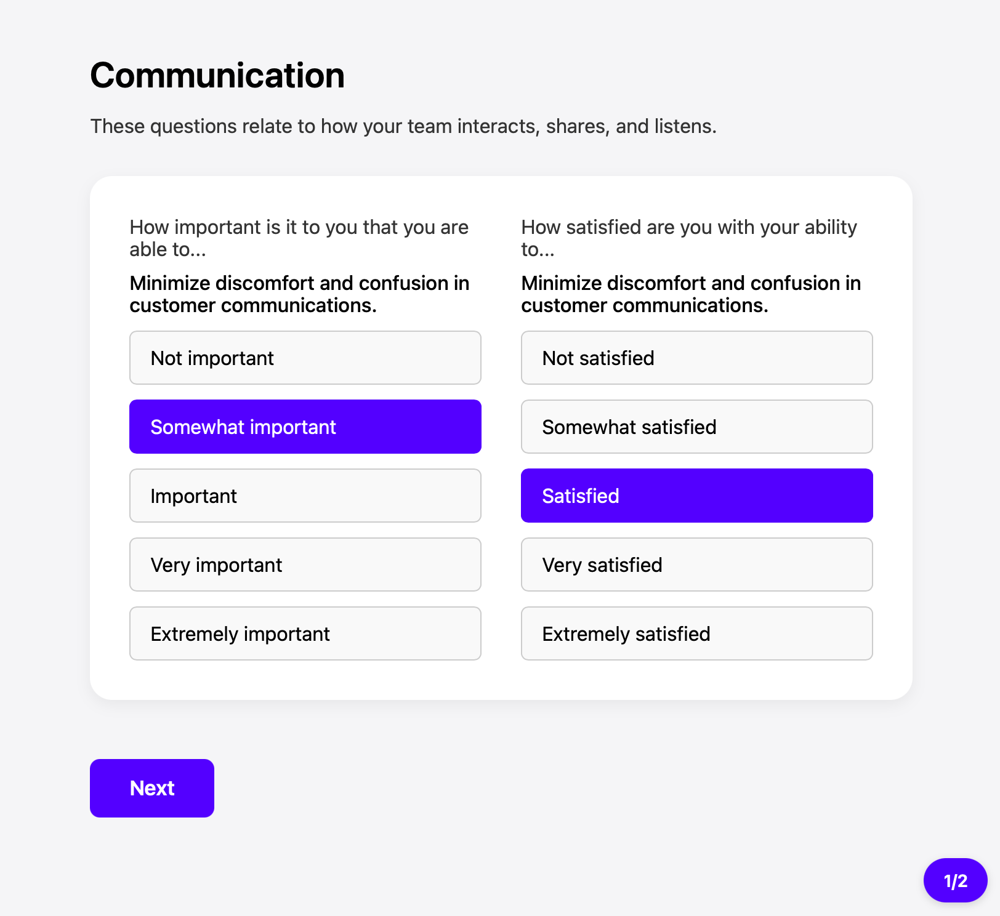

# Signal — lightweight ODI / JTBD survey collector

**Signal** is a tiny, self-hosted survey app for Outcome-Driven Innovation (ODI) and Jobs-To-Be-Done (JTBD) work.  
Instead of “questions,” it stores **outcome statements** in `outcomes.json` and turns them into two prompts in the UI:

*How important is it that you can…?*  
*How satisfied are you with your ability to…?*

That mirrors ODI practice: outcomes are capabilities to be improved, not trivia to be quizzed.

### Why Signal?

* **Zero-bloat setup** — drop in a JSON file, share a tokenised link, start collecting data.  
* **Analysis-ready output** — one row per outcome per respondent → perfect for PCA, clustering, and opportunity scoring (see the full workflow [here](https://redlandroad.com/2024/05/27/practical-outcome-driven-innovation/)).  
* **Plays well with existing pipelines** — use your own CRM / panel tool to generate tokens and meta-data; Signal just captures the ratings.

Put simply: it strips the busy-work out of ODI surveys so you can spend more cycles on insight, not instruments.

Built with:
- ⚛️ React (Vite)
- 🐍 Python Flask
- 📄 Flat-file config (JSON)
- 🎯 Token-based access

Here’s what the survey looks like:



---

## ✨ Features

- Welcome and thank-you screens with respondent name
- Outcome question paging by category
- Clean card UI
- Token-secured access per respondent
- Dynamic time estimate
- Configurable via simple JSON files
- JSONL output for post-processing and analysis

---

## 🚀 Getting Started

### 1. Clone the repo

```bash
git clone https://github.com/YOUR_USERNAME/signal.git
cd signal
```

### 2. Install dependencies

#### Backend (Flask):

From your project root (signal/):

```bash
python3 -m venv venv
source venv/bin/activate
pip install -r requirements.txt
```

#### Frontend (React):

```bash
cd client
npm install
```

---

## 🧪 Running locally

### Terminal 1 – Start the Flask API

```bash
cd server
source ../venv/bin/activate
python3 app.py
```

### Terminal 2 – Start the React app

```bash
cd client
npm run dev
```

Then open: [http://localhost:5173/?token=abc123](http://localhost:5173/?token=abc123)

---

## 🔐 Access model

Configure each respondent in `server/tokens.json`:

```json
{
  "abc123": {
	"respondentId": "r001",
	"name": "Alice Becker"
  }
}
```

Distribute private survey links:  
`https://yourdomain.com/?token=abc123`

---

## 🧾 Configuration Files

| File                | Description                      |
|---------------------|----------------------------------|
| `survey.json`       | Outcome statements               |
| `categories.json`   | Category names + groupings       |
| `survey-meta.json`  | Survey title and subtitle        |
| `strings.json`      | All UI labels, buttons, etc.     |
| `tokens.json`       | Maps tokens to respondent data   |

---

## 💾 Output Format

Stored in `server/responses.jsonl` (1 row per outcome):

```json
{"respondentId":"r001","outcomeId":"q1","outcomeImportance":4,"outcomeSatisfaction":3}
```

This is ideal for PCA, clustering, and scoring in Python/R.

---

## 📦 Folder Structure

```
signal/
├── client/         # React frontend
│   ├── src/        # App.jsx, App.css
│   ├── index.html
│   └── vite.config.js
├── server/         # Flask backend
│   ├── app.py
│   ├── survey.json
│   ├── tokens.json
│   ├── categories.json
│   ├── strings.json
│   └── survey-meta.json
├── requirements.txt
├── README.md
└── .gitignore
```

---

## 📄 .gitignore example

```gitignore
# Python
venv/
__pycache__/
*.pyc

# Node
node_modules/
dist/

# Runtime data
server/responses.jsonl
.env
.DS_Store
```

---

## 🛰 Deployment (Free Hosting)

### Host Flask on Render (https://render.com)

1. Sign in to [Render](https://render.com)
2. Create a new **Web Service**
3. Connect your GitHub repo
4. Choose:
   - Runtime: **Python 3**
   - Build command: `pip install -r requirements.txt`
   - Start command: `python app.py`
5. Add `PORT=5000` in environment variables

### Frontend

You can deploy the React frontend to:

- ✅ **Netlify** (recommended for static builds)
- ✅ **Vercel** (fast, free)
- ✅ **GitHub Pages** (if you export a static build)

```bash
cd client
npm run build
```

Then deploy `client/dist` to your hosting provider of choice.

---

## 🧠 Inspired by

- Strategyn's ODI research
- John Cutler's outcome-centric thinking
- Just enough tooling

---

## 🪪 License

MIT — use freely, contribute optionally.